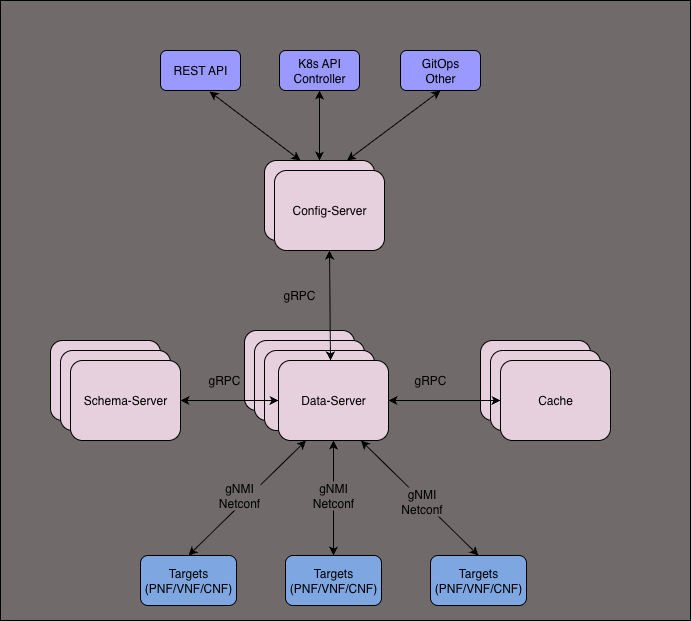

# Schema driven configuration

The paradigm of schema-driven API approaches is gaining increasing popularity as it facilitates programmatic interaction with systems by both machines and humans. While OpenAPI schema stands out as a widely embraced system, there are other notable schema approaches like YANG, among others. This project endeavors to empower users with a declarative and idempotent method for seamless interaction with API systems, providing a robust foundation for effective system configuration."

## Architecture

The project consists of 4 components:

### Schema-server

The schema server component is a versatile repository for schemas from diverse vendors and versions. It features a GRPC API for seamless schema querying and dynamic management, allowing users to load and unload schemas in real time. The integration of a CLI enhances user interaction, providing a familiar command-line interface. Operating in a stateless architecture, it offers scalability, while optional schema persistence caters to users requiring persistent storage. In essence, the schema server combines flexibility, efficiency, and user-friendliness for effective schema management in dynamic API environments.

### Data-server

The data-server component serves as a versatile intermediary, connecting the config-server, schema-server, cache, and xNF/Device in a stateless design for scalability. It features a North-bound API for both imperative and declarative interactions and supports various South-bound protocols. With dedicated DataStores per target, flexible synchronization options, candidate-based interactions, and the ability to connect multiple data servers per device, it provides a resilient and adaptable foundation for managing and synchronizing data in dynamic system environments.

### Cache

The cache component manages multiple datastores, including Config, State, and Intended, along with Intent metadata. It offers the option for persistent data storage, complemented by a GRPC API for seamless interaction. Additionally, the cache component provides a derived Command Line Interface (CLI) for user-friendly access and configuration.

### Config-server

The config-server is a Kubernetes-based Operator and comprises of several controllers:

- Schema Controller: Manages the lifecycle of schemas using Schema Custom Resources (CR).
- Discovery Controller: Manages the lifecycle of targets through DiscoveryRule CR, discovering devices/NF(s)
- Target Controller: Manages the lifecycle of Target DataStores using Target CR.
- Config API Server: Manages the lifecycle of Config resources.
    - Utilizes its storage backend (not etcd).
    - Interacts declaratively with the data-server through Intent transactions.
    - Implements validation checks, rejecting configurations that fail validation.

## Features

- Schema's: [YANG][yang], others TBD
- Targets: Physical devices (`PNF`), Containers (`CNF`), Virtual Machines (`VNF`) and Dummy test target (`NOOP`)
- Vendor agnostic
- Flexible deployments: Small, medium or large scale scaled out deployments
- Target Protocols: [gNMI][gnmi], [Netconf][netconf]
- Full Config or Config Snippets
- Declarative Operation

## Join us

Have questions, ideas, bug reports or just want to chat? Come join [our discord server](https://discord.gg/6P8mDvAh).

[yang]: https://en.wikipedia.org/wiki/YANG
[gnmi]: https://github.com/openconfig/reference/blob/master/rpc/gnmi/gnmi-specification.md
[netconf]: https://en.wikipedia.org/wiki/NETCONF