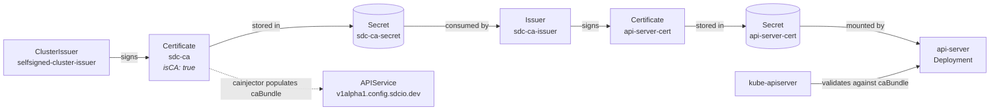

# Cert-Manager & TLS Trust Chain

The SDC `api-server` registers itself with Kubernetes as an
[aggregated API server][agg-api] to store the `config` and `configset`
resources outside of etcd. kube-apiserver only proxies requests to it when
it can validate the served TLS certificate against a CA that the
`APIService` object trusts.

SDC builds that trust chain with [cert-manager][cm-home], following the
[self-signed bootstrapping pattern][cm-bootstrap].

!!! note
    Make sure cert-manager is installed and Ready first — see
    [Pre-Requisites › Install cert-manager](2_prereq.md#install-cert-manager).

## Chain overview



| Resource | Role in SDC |
| --- | --- |
| `selfsigned-cluster-issuer` | Bootstraps the chain so the SDC root CA can sign itself. |
| `sdc-ca` | The SDC root CA. Its key/cert pair is written to the `sdc-ca-secret` Secret and is the trust anchor for every SDC certificate. |
| `sdc-ca-issuer` | Namespaced issuer in `sdc-system` that uses `sdc-ca-secret` to sign SDC workload certificates. |
| `api-server-cert` | Serving cert for the SDC api-server. Its Secret is mounted by the api-server Deployment at `/apiserver.local.config/certificates`. |

## APIService CA injection

For kube-apiserver to accept the api-server's TLS cert, the `APIService`'s
`spec.caBundle` must contain a CA that signed it. SDC sets the `caBundle`
declaratively by annotating the `APIService`:

```yaml
apiVersion: apiregistration.k8s.io/v1
kind: APIService
metadata:
  name: v1alpha1.config.sdcio.dev
  annotations:
    cert-manager.io/inject-ca-from: sdc-system/sdc-ca
spec:
  group: config.sdcio.dev
  service:
    name: api-server
    namespace: sdc-system
    port: 6443
  version: v1alpha1
  versionPriority: 15
  groupPriorityMinimum: 1000
```

The annotation references the **CA `Certificate`** (`sdc-system/sdc-ca`),
not the leaf. cert-manager's `cainjector` reads the `ca.crt` from
`sdc-ca-secret` and writes it into `spec.caBundle`, refreshing it whenever
the CA rotates.

## Renewal

cert-manager renews each `Certificate` on its own schedule based on its
`duration` / `renewBefore`.

- **`api-server-cert`** — re-issued in place into the `api-server-cert`
  Secret. The kubelet refreshes the Secret-backed volume mount and the
  api-server hot-reloads the new key/cert from disk; no pod restart is
  needed.

- **`sdc-ca`** — re-issued into `sdc-ca-secret` and `cainjector` writes the
  new CA into the `APIService.caBundle`. cert-manager does **not** cascade
  the CA renewal to leaves, so any cert signed by the previous CA stops
  validating against the new bundle and must be rotated — either by waiting
  for its own `renewBefore` window or by forcing a renewal, e.g.:

    ```bash
    cmctl renew -n sdc-system api-server-cert
    ```

    Plan CA renewals accordingly: the `sdc-ca` `Certificate` ships with a
    long `duration` (10 years) so this doesn't happen often.

## Verifying the chain

After installing SDC, all of the following should be `Ready` / `True`:

```bash
kubectl get clusterissuer selfsigned-cluster-issuer
kubectl -n sdc-system get issuer sdc-ca-issuer
kubectl -n sdc-system get certificate sdc-ca api-server-cert
kubectl get apiservice v1alpha1.config.sdcio.dev
```

The `APIService` should show `Available=True` once `cainjector` has
populated `spec.caBundle` and the api-server pod is serving on `:6443`.

[agg-api]: https://kubernetes.io/docs/tasks/extend-kubernetes/configure-aggregation-layer/
[cm-home]: https://cert-manager.io
[cm-bootstrap]: https://cert-manager.io/docs/configuration/selfsigned/#bootstrapping-ca-issuers
