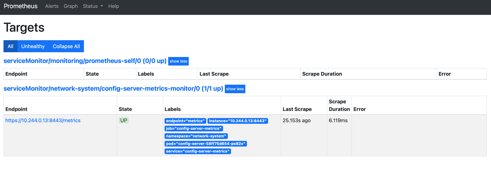
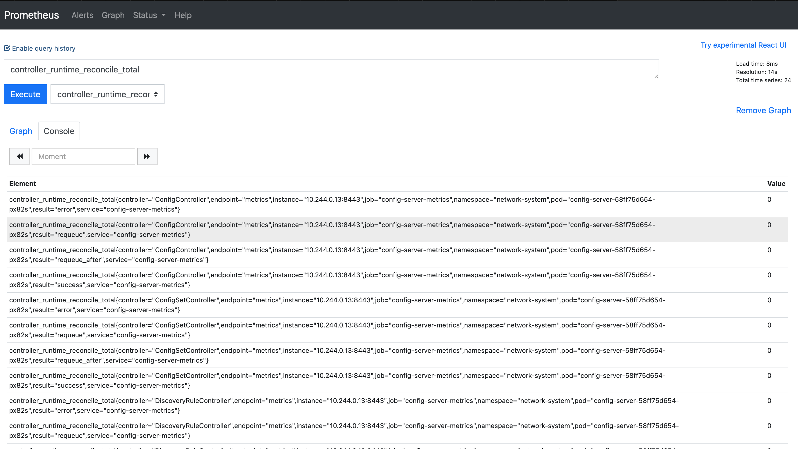

# Monitoring using Prometheus Operator

You can install the [Prometheus Operator][prometheus-operator] in the Kubernetes Cluster, configure it to scrape an endpoint. In this guide we walk through the steps to configure the [Prometheus Operator][prometheus-operator] for scraping metrics from the config-server.

!!! Note "this guide is not a production deployment guide but rather a guide to help you to get started in the lab"

## Install the Prometheus Operator

Install Prometheus Operator into the Kubernetes Cluster. This includes all of Prometheus Operator’s Kubernetes custom resource definitions (CRDs) that define the Prometheus, and ServiceMonitor abstractions used to configure the monitoring stack.

!!! Note "this instruction deploys the Prometheus Operator in the default namespace. To install in another namespace refer to [Prometheus Operator][prometheus-operator]"

Install the Operator using the `bundle.yaml` file in the Prometheus Operator GitHub repository:

```shell
kubectl create -f https://raw.githubusercontent.com/prometheus-operator/prometheus-operator/master/bundle.yaml
```

You should see the following output:

```shell
customresourcedefinition.apiextensions.k8s.io/alertmanagerconfigs.monitoring.coreos.com created
customresourcedefinition.apiextensions.k8s.io/alertmanagers.monitoring.coreos.com created
customresourcedefinition.apiextensions.k8s.io/podmonitors.monitoring.coreos.com created
customresourcedefinition.apiextensions.k8s.io/probes.monitoring.coreos.com created
customresourcedefinition.apiextensions.k8s.io/prometheuses.monitoring.coreos.com created
customresourcedefinition.apiextensions.k8s.io/prometheusrules.monitoring.coreos.com created
customresourcedefinition.apiextensions.k8s.io/servicemonitors.monitoring.coreos.com created
customresourcedefinition.apiextensions.k8s.io/thanosrulers.monitoring.coreos.com created
clusterrolebinding.rbac.authorization.k8s.io/prometheus-operator created
clusterrole.rbac.authorization.k8s.io/prometheus-operator created
deployment.apps/prometheus-operator created
serviceaccount/prometheus-operator created
service/prometheus-operator created
```

Verify that the installation succeeded:

```shell
kubectl get deploy
```

```shell
NAME                  READY   UP-TO-DATE   AVAILABLE   AGE
prometheus-operator   1/1     1            1           31m
```

## Configure the Prometheus Operator

Create a monitoring namespace:

```shell
kubectl create ns monitoring
```

Create RBAC permissions:

```shell
kubectl apply -f - <<EOF
apiVersion: v1
kind: ServiceAccount
metadata:
  name: prometheus
  namespace: monitoring
EOF
```

```shell
kubectl apply -f - <<EOF
apiVersion: rbac.authorization.k8s.io/v1
kind: ClusterRole
metadata:
  name: prometheus
rules:
- apiGroups: [""]
  resources:
  - nodes
  - nodes/metrics
  - services
  - endpoints
  - pods
  verbs: ["get", "list", "watch"]
- apiGroups: [""]
  resources:
  - configmaps
  verbs: ["get"]
- apiGroups:
  - networking.k8s.io
  resources:
  - ingresses
  verbs: ["get", "list", "watch"]
- nonResourceURLs: ["/metrics"]
  verbs: ["get"]
EOF
```

```shell
kubectl apply -f - <<EOF
apiVersion: rbac.authorization.k8s.io/v1
kind: ClusterRoleBinding
metadata:
  name: prometheus
roleRef:
  apiGroup: rbac.authorization.k8s.io
  kind: ClusterRole
  name: prometheus
subjects:
- kind: ServiceAccount
  name: prometheus
  namespace: monitoring
EOF
```

Deploy Prometheus:

```shell
kubectl apply -f - <<EOF
apiVersion: monitoring.coreos.com/v1
kind: Prometheus
metadata:
  name: prometheus
  namespace: monitoring
  labels:
    app: prometheus
spec:
  image: quay.io/prometheus/prometheus:v2.22.1
  nodeSelector:
    kubernetes.io/os: linux
  replicas: 2
  resources:
    requests:
      memory: 400Mi
  securityContext:
    fsGroup: 2000
    runAsNonRoot: true
    runAsUser: 1000
  serviceAccountName: prometheus
  version: v2.22.1
  serviceMonitorSelector: {}
  serviceMonitorNamespaceSelector: {}
EOF
```

Verify Prometheus is running:

```shell
kubectl get statefulsets.apps -n monitoring 
```

```shell
NAME                    READY   AGE
prometheus-prometheus   2/2     30m
```

## Deploy the config-server service monitor

Configure the service monitor that enables Prometheus to scrape metrics from the config-server:

```shell
kubectl apply -f - <<EOF
apiVersion: monitoring.coreos.com/v1
kind: ServiceMonitor
metadata:
  labels:
    app.kubernetes.io/name: config-server
  name: config-server-metrics-monitor
  namespace: sdc-system
spec:
  endpoints:
    - interval: 30s
      path: /metrics
      port: metrics # Ensure this is the name of the port that exposes HTTPS metrics
      scheme: https
      # bearerTokenFile: /var/run/secrets/kubernetes.io/serviceaccount/token
      tlsConfig:
        # TODO(user): The option insecureSkipVerify: true is not recommended for production since it disables
        # certificate verification. This poses a significant security risk by making the system vulnerable to
        # man-in-the-middle attacks, where an attacker could intercept and manipulate the communication between
        # Prometheus and the monitored services. This could lead to unauthorized access to sensitive metrics data,
        # compromising the integrity and confidentiality of the information.
        # Please use the following options for secure configurations:
        # caFile: /etc/metrics-certs/ca.crt
        # certFile: /etc/metrics-certs/tls.crt
        # keyFile: /etc/metrics-certs/tls.key
        insecureSkipVerify: true
  selector:
    matchLabels:
      app.kubernetes.io/name: config-server
      app: prometheus
EOF
```

To verify the scraping works, login to the Prometheus web service. We expose the Prometheus server using port forwarding.

```shell
kubectl --namespace monitoring port-forward svc/prometheus-operated 9090
```

Navigate to http://localhost:9090 to access the Prometheus interface:

Click on Status, then Targets to see any configured scrape targets.



Navigate to Graph to test metrics collection:



In the Expression box, type `controller_runtime_reconcile_total`, and press ENTER.

## Troubleshooting

In case of trouble here is a link to the [troubleshooting-guide][troubleshooting-guide]

[prometheus-operator]: https://github.com/prometheus-operator/prometheus-operator
[troubleshooting-guide]: https://github.com/prometheus-operator/prometheus-operator/blob/main/Documentation/platform/troubleshooting.md 
