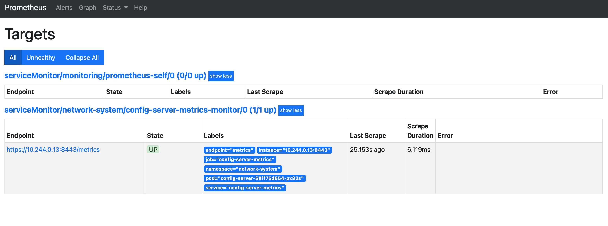
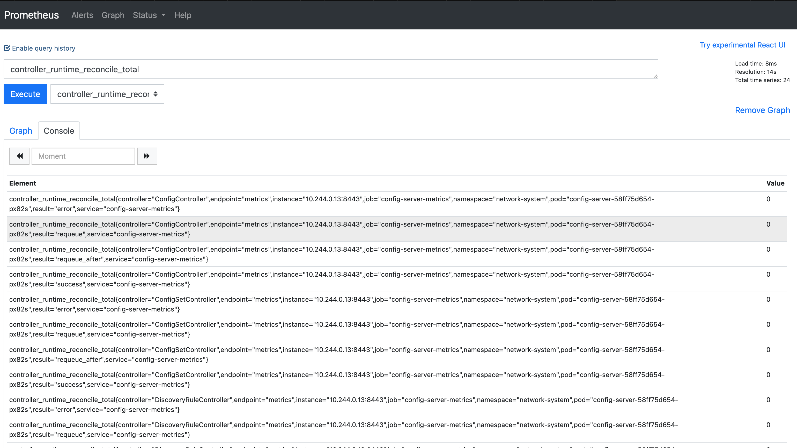

# Config-server metrics and Prometheus Operator

## What SDC exposes

From **config-server v0.0.42** onward, the operator exposes **controller-runtime** metrics on its HTTPS metrics endpoint (for example `controller_runtime_reconcile_*`, workqueue depth, and webhook latency where applicable). Scraping that endpoint with Prometheus is the usual way to observe reconciliation behaviour in a cluster.

This page is a **lab-oriented walkthrough**: install the [Prometheus Operator][prometheus-operator], run a minimal Prometheus, add a `ServiceMonitor` that scrapes config-server in the `sdc-system` namespace, and confirm targets in the UI. It is **not** a production hardening guide (TLS verification, retention, HA, and alerting are out of scope).

## Install the Prometheus Operator

The Operator ships Kubernetes CRDs (`Prometheus`, `ServiceMonitor`, and related types) and controllers that reconcile them.

!!! note "Namespace"

    The steps below install the operator Deployment in the **default** namespace. To install elsewhere, follow the [Prometheus Operator][prometheus-operator] documentation for your layout.

Apply the upstream bundle (pin or vendor this manifest for anything beyond a throwaway cluster):

```shell
kubectl apply -f https://raw.githubusercontent.com/prometheus-operator/prometheus-operator/master/bundle.yaml
```

Example output (truncated):

```text
customresourcedefinition.apiextensions.k8s.io/... created
deployment.apps/prometheus-operator created
service/prometheus-operator created
```

Verify the operator Deployment:

```shell
kubectl get deploy -n default
```

```text
NAME                  READY   UP-TO-DATE   AVAILABLE   AGE
prometheus-operator   1/1     1            1           ...
```

## Prometheus namespace, RBAC, and Prometheus CR

Create a `monitoring` namespace and a dedicated `ServiceAccount` for Prometheus:

```shell
kubectl create ns monitoring
```

```shell
kubectl apply -f - <<EOF
apiVersion: v1
kind: ServiceAccount
metadata:
  name: prometheus
  namespace: monitoring
EOF
```

Grant read-only cluster discovery permissions that the Prometheus Operator expects for target discovery:

```shell
kubectl apply -f - <<EOF
apiVersion: rbac.authorization.k8s.io/v1
kind: ClusterRole
metadata:
  name: prometheus
rules:
- apiGroups: [""]
  resources:
  - nodes
  - nodes/metrics
  - services
  - endpoints
  - pods
  verbs: ["get", "list", "watch"]
- apiGroups: [""]
  resources:
  - configmaps
  verbs: ["get"]
- apiGroups:
  - networking.k8s.io
  resources:
  - ingresses
  verbs: ["get", "list", "watch"]
- nonResourceURLs: ["/metrics"]
  verbs: ["get"]
EOF
```

```shell
kubectl apply -f - <<EOF
apiVersion: rbac.authorization.k8s.io/v1
kind: ClusterRoleBinding
metadata:
  name: prometheus
roleRef:
  apiGroup: rbac.authorization.k8s.io
  kind: ClusterRole
  name: prometheus
subjects:
- kind: ServiceAccount
  name: prometheus
  namespace: monitoring
EOF
```

Create a `Prometheus` CR that selects `ServiceMonitor` objects in any namespace (lab default). **Adjust `image` / `version` to a supported release** for your environment—the example tags below are illustrative:

```shell
kubectl apply -f - <<EOF
apiVersion: monitoring.coreos.com/v1
kind: Prometheus
metadata:
  name: prometheus
  namespace: monitoring
  labels:
    app: prometheus
spec:
  image: quay.io/prometheus/prometheus:v2.22.1
  nodeSelector:
    kubernetes.io/os: linux
  replicas: 2
  resources:
    requests:
      memory: 400Mi
  securityContext:
    fsGroup: 2000
    runAsNonRoot: true
    runAsUser: 1000
  serviceAccountName: prometheus
  version: v2.22.1
  serviceMonitorSelector: {}
  serviceMonitorNamespaceSelector: {}
EOF
```

Check the StatefulSet:

```shell
kubectl get statefulsets.apps -n monitoring
```

```text
NAME                    READY   AGE
prometheus-prometheus   2/2     ...
```

## ServiceMonitor for config-server

Apply a `ServiceMonitor` in **`sdc-system`** so Prometheus discovers the config-server metrics `Service`. The endpoint uses **HTTPS** on the port named **`metrics`**.

!!! warning "TLS in production"

    `insecureSkipVerify: true` is **not** suitable for production: it disables server certificate verification. Prefer a proper `tlsConfig` with `caFile` / `certFile` / `keyFile` (or equivalent secrets mounted into Prometheus) once you know how your metrics certificates are issued.

```shell
kubectl apply -f - <<EOF
apiVersion: monitoring.coreos.com/v1
kind: ServiceMonitor
metadata:
  labels:
    app.kubernetes.io/name: config-server
  name: config-server-metrics-monitor
  namespace: sdc-system
spec:
  endpoints:
    - interval: 30s
      path: /metrics
      port: metrics
      scheme: https
      tlsConfig:
        insecureSkipVerify: true
  selector:
    matchLabels:
      app.kubernetes.io/name: config-server
      app: prometheus
EOF
```

Confirm that the labels on your config-server metrics `Service` match the `selector` above; change `matchLabels` if your Helm chart or install uses different keys.

## Confirm scraping in the Prometheus UI

Port-forward the Prometheus service:

```shell
kubectl --namespace monitoring port-forward svc/prometheus-operated 9090
```

Open [http://localhost:9090](http://localhost:9090). Under **Status → Targets**, confirm the config-server job is **UP**. Under **Graph**, try:

```promql
controller_runtime_reconcile_total
```





## Related docs

- [Subscription example with Prometheus](../user-guide/configuration/subscription/prometheus.md) — additional `ServiceMonitor` patterns for target metrics.

## Troubleshooting

- SDC-focused issues: [Troubleshooting](../user-guide/troubleshooting.md).
- Prometheus Operator platform notes: [Prometheus Operator troubleshooting][prometheus-operator-troubleshooting].

[prometheus-operator]: https://github.com/prometheus-operator/prometheus-operator
[prometheus-operator-troubleshooting]: https://github.com/prometheus-operator/prometheus-operator/blob/main/Documentation/platform/troubleshooting.md
