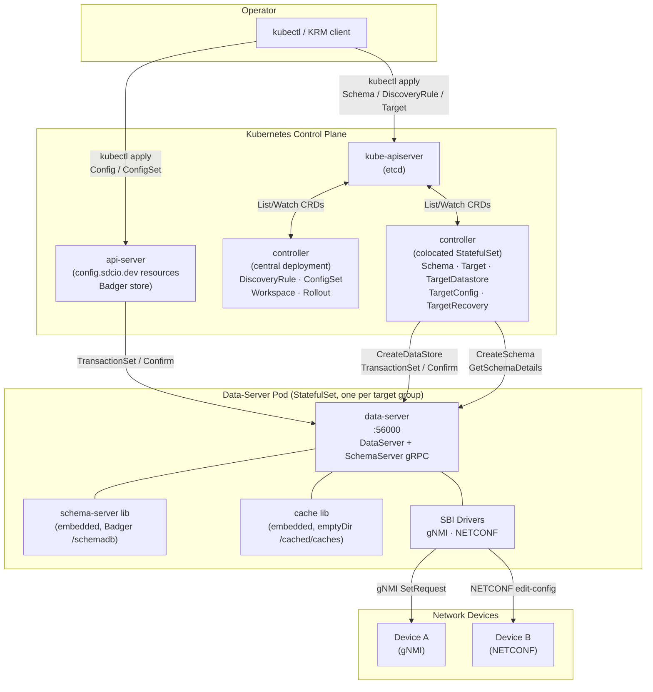
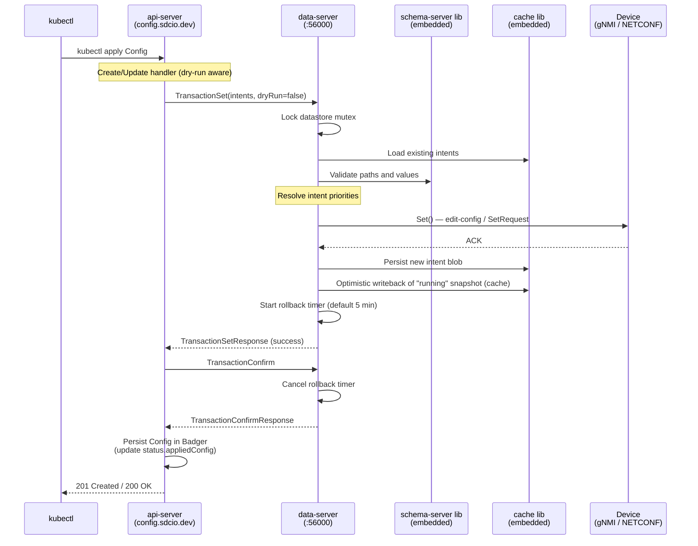

# System Architecture

## Overview

SDC is a Kubernetes-native, model-driven network configuration system. It bridges the
Kubernetes resource model to real network devices by translating Kubernetes Custom Resources
into vendor-specific southbound protocol operations (gNMI, NETCONF). Operators define
desired device configuration as Kubernetes objects; SDC resolves intent priority conflicts,
validates all changes against YANG schemas, and pushes the resulting configuration to
devices using a confirmed-commit pattern.

The system is YANG-first: every configuration path and value is validated against a parsed
YANG schema before it reaches a device. Schemas are loaded from Git repositories and stored
in an embedded schema store (persistent or in-memory mode), then served to all components
that need type or namespace information. This validation layer makes it impossible to push
schema-invalid configuration to a device.

SDC is delivered as a full Kubernetes-native platform, with the control plane exposing a
standard Kubernetes API surface where operators use `kubectl` and familiar KRM workflows.
Some components (for example `data-server`) can also run standalone via gRPC for
non-Kubernetes integrations. Under the hood, config-server translates KRM operations into
gRPC calls to data-server, which in turn drives devices over gNMI or NETCONF.

---

## High-Level Architecture

---

## Northbound Interface

Operators interact with SDC entirely through Kubernetes resources. There are two API
groups:

**`inv.sdcio.dev`** — inventory and infrastructure resources stored in etcd via standard
CRDs. These include [`Schema`](../user-guide/configuration/schemas.md) (YANG model references),
[`DiscoveryRule`](../user-guide/configuration/discovery/introduction.md) (IP scanning
configuration),
[`TargetConnectionProfile`](../user-guide/configuration/target-profiles/connection-profile.md),
[`TargetSyncProfile`](../user-guide/configuration/target-profiles/sync-profile.md),
[`Subscription`](../user-guide/configuration/subscription/subscription.md),
[`Workspace`](config-server.md#workspace-reconciler), and [`Rollout`](config-server.md#rollout-reconciler).

**`config.sdcio.dev`** — configuration resources stored in a local Badger database via an
aggregated API server. This group contains [`Target`](../user-guide/configuration/target/target.md)
(managed device endpoint),
[`Config`](../user-guide/configuration/config/config.md) and
[`ConfigSet`](../user-guide/configuration/config/configset.md) (desired device configuration
blobs), [`Deviation`](../user-guide/deviation.md) (detected drift from intended state),
[`RunningConfig`](../getting-started/basic-usage.md) (read-only live device state), and
[`ConfigBlame`](../getting-started/basic-usage.md) (per-path intent ownership). The
aggregated server bypasses etcd deliberately: individual Config objects can be megabytes in
size when representing a full device configuration, exceeding etcd's 1.5 MB per-object
limit.

The Kubernetes-native design means operators get familiar tools for free: `kubectl apply`,
`kubectl diff`, `kubectl dry-run`, RBAC, admission webhooks, and GitOps workflows all work
without modification.

### Embedded vs Standalone Ports

In the default deployment, schema-server and cache are embedded libraries inside
`data-server`, so config-server talks to both `DataServer` and `SchemaServer` APIs through
the data-server endpoint (`:56000` in this documentation set). The `:55000` (schema-server)
and `:50100` (cache) ports are standalone service defaults used only when those components are
deployed out-of-process.

---

## Southbound Interface

Devices are reached through one of two embedded SBI drivers compiled directly into the
`data-server` binary. There is no external driver process or plugin system.

| Driver | Protocol | Library |
|--------|----------|---------|
| `gnmi` | gNMI over gRPC/TLS | `github.com/openconfig/gnmic` |
| `netconf` | NETCONF over SSH (RFC 6241) | `github.com/scrapli/scrapligo` |

The driver type is selected per-target at datastore creation time from the
[`TargetConnectionProfile.protocol`](../user-guide/configuration/target-profiles/connection-profile.md)
field. Both drivers implement the same [`Target`](data-server.md) interface (`Get`,
`Set`, `AddSyncs`, `Status`, `Close`), making the rest of data-server protocol-agnostic.

Sync goroutines continuously update the in-memory `syncTree` with live device state.
For gNMI targets, data-server can use streaming subscriptions (ON_CHANGE, SAMPLE),
periodic `Get` polling, and repeated ONCE subscriptions. For NETCONF targets, it polls
state using periodic `<get-config>` requests. This synchronized live view is used to
compute configuration deviations, provide validation context for subsequent
[`TransactionSet`](data-server.md) operations, and serve
[`RunningConfig`](../getting-started/basic-usage.md#retrieve-configuration) data through
the API.

---

## Data Flow: Configuration Change Lifecycle

The sequence below traces a `kubectl apply` of a `Config` object through to a device ACK.

If `TransactionConfirm` is not sent within the auto-cancel timeout, data-server
automatically rolls back by re-running `TransactionSet` with the previous intent content,
returning the device to its prior state.

In the default deployment, this persisted `"running"` snapshot lives in the cache on an
ephemeral `emptyDir` volume, so it is rebuilt after restart by replaying intents.

The `"running"` snapshot written here is data-server's local post-transaction view, not a
fresh state report pulled from the device. data-server applies the same accepted edits to
its in-memory running tree and persists that expected result. This gives subsequent
`TransactionSet` operations and deviation calculations an immediate baseline without
waiting for a fresh device poll/stream update. Normal sync then continues, and any drift is
reconciled on subsequent device sync cycles.

---

## Component Summary

| Component | Role | Stateful? | Key Protocol |
|-----------|------|-----------|-------------|
| **api-server** | Aggregated K8s API server for `config.sdcio.dev`; stores Config blobs in Badger; calls data-server on every write | Yes (Badger) | HTTPS (K8s aggregated API), gRPC to data-server |
| **controller (central)** | Runs DiscoveryRule, ConfigSet, Workspace, Rollout reconcilers | No | Kubernetes watch, gNMI (discovery) |
| **controller (colocated)** | Runs Schema, Target, TargetDatastore, TargetConfig, TargetRecovery, Subscription reconcilers; co-deployed with data-server | No | Kubernetes watch, gRPC to data-server and schema-server |
| **data-server** | Southbound agent: owns one Datastore per target; embeds schema-server and cache libraries; pushes config to devices | Yes (Badger schema DB, ephemeral intent cache) | gRPC (DataServer + SchemaServer), gNMI, NETCONF |
| **schema-server** (embedded) | Parses YANG modules; stores schema objects in Badger; serves type/namespace info | Yes (Badger) | In-process (or gRPC `:55000` if split out) |
| **cache** (embedded) | Intent-blob persistence; one instance per target device | Ephemeral (`emptyDir`) | In-process (or gRPC `:50100` if split out) |
| **SBI drivers** | Protocol adapters (gNMI, NETCONF) compiled into data-server | No | gNMI over gRPC, NETCONF over SSH |
