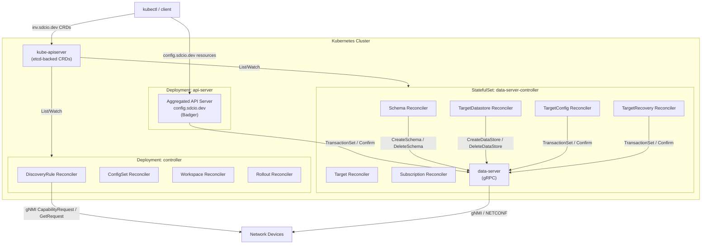
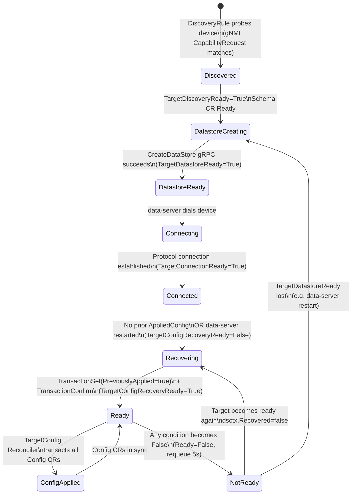

# Config Server

## Overview

The config-server is the Kubernetes-native northbound entry point for sdcio. It exposes network configuration via Kubernetes Custom Resources and an aggregated API server, drives discovery of network devices, manages YANG schema ingestion, and orchestrates the application of configuration intents to data-server targets.

The config-server does **not** communicate directly with network devices. All device interaction is delegated to the [data-server](data-server.md) over gRPC.

## Architecture

The config-server consists of two binaries compiled from the same repository, deployed as three distinct Kubernetes workloads.

| Binary | K8s Workload | Role | Key env vars |
|--------|-------------|------|--------------|
| `controller` | `Deployment/controller` | Runs DiscoveryRule, ConfigSet, Workspace, Rollout reconcilers | `ENABLE_DISCOVERYRULE`, `ENABLE_CONFIGSET`, `ENABLE_WORKSPACE`, `ENABLE_ROLLOUT` |
| `controller` | `StatefulSet/data-server-controller` (colocated with data-server) | Runs Schema, Target, TargetDatastore, TargetConfig, TargetRecoveryConfig, Subscription reconcilers | `LOCAL_DATASERVER=true`, `ENABLE_SCHEMA`, `ENABLE_TARGET`, `ENABLE_TARGETDATASTORE`, `ENABLE_TARGETCONFIG`, `ENABLE_TARGETRECOVERYCONFIG`, `ENABLE_SUBSCRIPTION` |
| `api-server` | `Deployment/api-server` | Aggregated Kubernetes API server for `config.sdcio.dev` resources stored in Badger | `--tls-cert-file`, `--tls-private-key-file`, `--secure-port=6443` |

**Reconciler enabling mechanism:** At startup, the controller binary calls `IsReconcilerEnabled(name)`, which reads `ENABLE_<NAME_UPPERCASE>`. Any value other than `"false"` activates the reconciler.

**`LOCAL_DATASERVER` mode:** When `LOCAL_DATASERVER=true`, the controller binary creates a `TargetManager` that maintains gRPC connections to the local data-server sidecar on `localhost:<SDC_DATA_SERVER_PORT>`. This is required for the TargetDatastore, TargetConfig, TargetRecoveryConfig, and Subscription reconcilers.

**Kubernetes API extension strategy:** Two complementary extension points are used:

- **Aggregated API Server** (`api-server` binary, `config.sdcio.dev` group): backed by Badger (`.WithoutEtcd()`), registered via an `APIService` object. Used because Config blobs can be megabytes in size and etcd enforces a 1.5 MB per-object limit.
- **Standard CRD controller** (`controller` binary, `inv.sdcio.dev` group): controller-runtime watches on CRDs backed by etcd in the normal way.

**Persistent volume layout (by workload):**

| PVC | Mount path | Consumer workload | Contents |
|-----|-----------|-------------------|----------|
| `pvc-schema-store` | `/schemas` | colocated controller + data-server StatefulSet | Raw YANG files git-cloned by the Schema Reconciler |
| `pvc-schema-db` | `/schemadb` | data-server StatefulSet | Badger DB of parsed schema proto objects |
| `pvc-config-store` | `/config` | api-server Deployment | Badger DB storing Config, ConfigSet, Target, Deviation objects |
| `pvc-workspace-store` | `/workspace` | central controller Deployment | Git workspace for Workspace / Rollout reconcilers |

The following diagram shows the high-level component topology:

## CRDs & KRM Resources

### `inv.sdcio.dev` — Standard CRDs (etcd-backed)

| Kind | Namespaced | Purpose | Key spec fields |
|------|-----------|---------|-----------------|
| `Schema` | Yes | YANG model reference | `provider`, `version`, `repositories[]{repoURL, ref, dirs[], schema{models, includes, excludes}}` |
| `DiscoveryRule` | Yes | IP-range device discovery | `prefixes[]`, `addresses[]`, `defaultSchema`, `discoveryProfile{connectionProfiles[]}`, `period`, `concurrentScans` |
| `DiscoveryVendorProfile` | Yes | gNMI discovery response parsing | `gnmi{organization, modelMatch, paths[]{key, path, script, regex}, encoding}` |
| `TargetConnectionProfile` | Yes | Protocol and auth parameters for a device | `protocol`, `port`, `encoding`, `preferredNetconfVersion`, `commitCandidate`, `insecure`, `skipVerify` |
| `TargetSyncProfile` | Yes | Sync subscription configuration | `validate`, `buffer`, `workers`, `sync[]{name, protocol, paths[], mode, interval}` |
| `Subscription` | Yes | Telemetry subscriptions | `target.targetSelector`, `protocol`, `subscriptions[]{paths[], mode, interval}` |
| `Workspace` | Yes | Git repository for config templates | `repoURL`, `ref`, `credentials` |
| `Rollout` | Yes | Bulk config push from a workspace | `repoURL`, `strategy`, `skipUnavailableTarget` |

### `config.sdcio.dev` — Aggregated API Server (Badger-backed)

| Kind | Namespaced | Purpose | Key spec fields |
|------|-----------|---------|-----------------|
| `Target` | Yes | A managed network device | `provider`, `address`, `credentials`, `tlsSecret`, `connectionProfile`, `syncProfile` |
| `Config` | Yes | Desired device configuration intent | `lifecycle`, `priority` (int32), `revertive`, `config[]{path, value}` |
| `SensitiveConfig` | Yes | Config intent containing credentials | Same as `Config` (credential-aware RBAC) |
| `ConfigSet` | Yes | Config template applied to multiple targets via label selector | `target.targetSelector`, `priority`, `config[]{path, value}` |
| `Deviation` | Yes | Detected config drift (computed, not user-supplied) | — |
| `RunningConfig` | Yes | Live device state snapshot (read-only) | — |
| `ConfigBlame` | Yes | Per-path intent ownership (read-only) | — |

## Reconcilers

All reconcilers are implemented using `sigs.k8s.io/controller-runtime`. Each reconciler registers itself via `reconcilers.Register(name, &reconciler{})` in an `init()` function. The controller binary iterates `reconcilers.Reconcilers` at startup and calls `SetupWithManager` only if `IsReconcilerEnabled(name)` returns true.

### Schema Reconciler

**Source:** `pkg/reconcilers/schema/reconciler.go`

**Watches:** `invv1alpha1.Schema`, `corev1.Secret`

**Purpose:** Downloads YANG files from Git repositories, then loads them into the schema-server via gRPC.

On reconcile, the reconciler first ensures a finalizer is present. It calls `schemaLoader.GetRef()` to check whether the YANG directory already exists on the shared PVC. If it does not, it sets a `Loading` condition and calls `schemaLoader.Load()`, which iterates `spec.repositories`, uses `github.com/go-git/go-git/v5` to clone each repository to a temporary directory, then copies the extracted paths to `<schemaBasePath>/<provider>/<version>/`.

Once files are present, the reconciler creates an ephemeral gRPC client to the schema-server. It calls `GetSchemaDetails` to check the current state. If the schema is missing or in a `FAILED` state, it calls `CreateSchema` with the model, include, and exclude path lists. On deletion, it calls `GetSchemaDetails` + `DeleteSchema` and removes the YANG files from disk via `schemaLoader.DelRef()`.

The schema-server address resolves in order: `SDC_SCHEMA_SERVER` env → `SDC_DATA_SERVER` env → `schema-server.sdc-system.svc.cluster.local:56000`. The schema base path is set by `SDC_SCHEMA_SERVER_BASE_DIR`, defaulting to `/schemas`.

**External calls:**
- `SchemaServer/GetSchemaDetails` → schema-server
- `SchemaServer/CreateSchema{Schema, File[], Directory[], Exclude[]}` → schema-server
- `SchemaServer/DeleteSchema` → schema-server

**Conditions updated:** `Ready` (true on success), `Failed` (on error), `Loading` (transient during download) — all on the `Schema` CR.

---

### DiscoveryRule Reconciler

**Source:** `pkg/reconcilers/discoveryrule/reconciler.go`

**Watches:** `invv1alpha1.DiscoveryRule`, `TargetConnectionProfile`, `TargetSyncProfile`, `corev1.Secret`

**Purpose:** Manages a long-running discovery goroutine per `DiscoveryRule` CR that periodically scans IP ranges and creates or updates `Target` CRs based on probe results.

On reconcile, the reconciler validates the spec and resolves referenced profiles into a normalized `DiscoveryRuleConfig`. If a goroutine is already running and `HasChanged()` returns false, the reconciler returns immediately. If the config has changed, the old goroutine is stopped and a new `dr.Run(baseCtx)` goroutine is started. `dr.Run()` loops at `spec.period` intervals across all configured prefixes and addresses.

Per-host discovery flow:

- **Static (discovery disabled):** If `spec.defaultSchema != nil`, the reconciler uses `Protocol_NONE` and creates a `Target` CR directly without probing the device.
- **gNMI:** Dials the target, sends a `CapabilityRequest`, and matches the returned `organization` string against `DiscoveryVendorProfile.gnmi.organization`. Then sends a `GetRequest` for each configured path (version, hostname, platform, serial, MAC). Raw values are processed by applying regex patterns and optionally a Starlark `transform(value)` function defined in `DiscoveryVendorProfile.gnmi.paths[].script` (using `go.starlark.net`).
- **NETCONF discovery:** Not yet implemented; only the static path is available.

**External calls:**
- `gNMI/CapabilityRequest` → network device
- `gNMI/GetRequest` → network device

**Conditions updated:** `Ready` on `DiscoveryRule` CR; `TargetDiscoveryReady=True` on created/updated `Target` CRs.

---

### Target Reconciler

**Source:** `pkg/reconcilers/target/reconciler.go`

**Watches:** `configv1alpha1.Target`

**Purpose:** Roll-up reconciler that computes the aggregate `Ready` condition on a `Target` CR by evaluating four sub-conditions in sequence.

`GetOverallStatus(target)` evaluates the conditions in priority order: `TargetDiscoveryReady` → `TargetDatastoreReady` → `TargetConfigRecoveryReady` → `TargetConnectionReady`. The first condition that is false sets `Ready=False` with a specific message indicating which gate failed. If the aggregate condition changed and the target is not ready, the reconciler requeues after 5 seconds.

On deletion, the reconciler removes the `Deviation` CR associated with the target and removes the finalizer.

**External calls:** None.

**Conditions updated:** `Ready` (aggregate) on `Target` CR.

---

### TargetDatastore Reconciler

**Source:** `pkg/reconcilers/targetdatastore/reconciler.go`

**Watches:** `configv1alpha1.Target`, `TargetConnectionProfile`, `TargetSyncProfile`, `corev1.Secret`, `invv1alpha1.Schema`

**Purpose:** Creates and destroys the data-server `Datastore` object for each target. Requires `LOCAL_DATASERVER=true`.

The reconciler first checks whether `TargetDiscoveryReady` is true. If not, it calls `targetMgr.ClearDesired()` and returns. It then checks whether the referenced `Schema` CR is in a `Ready` state; if not, it requeues after 10 seconds.

When ready to proceed, it builds a `CreateDataStoreRequest` from the target spec, resolved profiles, and referenced secrets, then computes a deterministic hash over the request. `targetMgr.ApplyDesired(ctx, targetKey, dsReq, usedRefs, hash)` drives the datastore lifecycle asynchronously. The reconciler reads runtime status back from `targetMgr.GetOrCreate(targetKey).Status()` to set the condition.

On deletion, it calls `targetMgr.ClearDesired()` + `targetMgr.Delete()` and removes the finalizer.

**External calls:**
- `DataServer/CreateDataStore` → data-server
- `DataServer/DeleteDataStore` → data-server
- `DataServer/GetDataStore` → data-server

**Conditions updated:** `TargetDatastoreReady` on `Target` CR.

---

### TargetConfig Reconciler

**Source:** `pkg/reconcilers/targetconfig/reconciler.go`

**Watches:** `configv1alpha1.Target`, `configv1alpha1.Config`

**Purpose:** Applies all `Config` CRs for a target whenever the target is ready and the datastore context reports it has been recovered.

The reconciler checks `target.IsReady()` — if false, it sets `TargetForConfigReady=Failed` on all `Config` CRs for this target and requeues after 5 seconds. It then checks `dsctx.Status.Recovered` — if false, it requeues after 5 seconds.

When both conditions are met, `transactor.Transact()` lists all `Config` CRs in the same namespace carrying the label `config.sdcio.dev/targetName`. Each config is classified as `update` (spec changed or not yet applied), `delete` (deletion timestamp present), or `noChange` (applied shasum matches spec shasum). A `TransactionSet` is issued with all intents, followed by `TransactionConfirm` on success. Each `Config` CR's status is updated with `appliedConfig` and `lastKnownGoodSchema`.

On target deletion, the reconciler sets `TargetForConfigReady=Failed` on all associated `Config` CRs.

**External calls:**
- `DataServer/TransactionSet` → data-server
- `DataServer/TransactionConfirm` → data-server

**Conditions updated:** `TargetForConfigReady` on `Target` CR; `ConfigReady` on each `Config` CR.

---

### TargetRecoveryConfig Reconciler

**Source:** `pkg/reconcilers/targetrecovery/reconciler.go`

**Watches:** `configv1alpha1.Target`

**Purpose:** Re-applies all previously-committed `Config` intents after a data-server restart, before normal reconciliation resumes.

The reconciler retrieves the `dsctx` from `targetMgr`. If it is nil, it requeues after 5 seconds. If `dsctx.Status.Recovered == true`, there is nothing to do and the reconciler returns.

`transactor.RecoverConfigs()` lists all `Config` CRs with `status.appliedConfig != nil` and builds `TransactionIntent` entries with `PreviouslyApplied: true` for each. It issues a `TransactionSet` with `transactionID="recovery"`, `DryRun=false`, and `Timeout=120s`, which re-installs all intents both onto the device and into the data-server cache. On success, `TransactionConfirm` is sent and `dsctx.MarkRecovered(true)` is called.

**External calls:**
- `DataServer/TransactionSet` (recovery transaction) → data-server
- `DataServer/TransactionConfirm` → data-server

**Conditions updated:** `TargetConfigRecoveryReady` on `Target` CR; `ConfigReady` on recovered `Config` CRs.

---

### ConfigSet Reconciler

**Source:** `pkg/reconcilers/configset/reconciler.go`

**Watches:** `configv1alpha1.ConfigSet`, `configv1alpha1.Target`

**Purpose:** Expands a `ConfigSet` into individual `Config` CRs — one per target matching the label selector — keeping them synchronized as targets come and go.

`unrollDownstreamTargets()` lists all `Target` CRs in the namespace matching `spec.target.targetSelector`. `ensureConfigs()` creates or updates a `Config` CR named `<configset-name>.<target-name>` for each matched target, carrying the same `spec.config` payload and `spec.priority`. Config CRs for targets that no longer match are deleted.

On deletion of a `ConfigSet`, the reconciler lists and deletes all owned child `Config` CRs and removes the finalizer only once all children have been garbage-collected. The per-target reconciliation status is surfaced in `ConfigSetStatus.Targets[]`.

**External calls:** None.

**Conditions updated:** `Ready` on `ConfigSet` CR; per-target `TargetForConfigReady` entries in `status.targets[]`.

---

### Subscription Reconciler

**Source:** `pkg/reconcilers/subscription/reconciler.go`

**Watches:** `invv1alpha1.Subscription`, `configv1alpha1.Target`

**Purpose:** Registers and deregisters telemetry subscriptions on data-server targets based on `Subscription` CRs.

On delete, `targetMgr.RemoveSubscription()` is called. Otherwise, `targetMgr.ApplySubscription(ctx, subscription)` registers the subscription across all targets matching `spec.target.targetSelector`.

**External calls:** Indirect — via `TargetManager` which manages gRPC connections to the local data-server.

**Conditions updated:** `Ready` on `Subscription` CR.

---

### Workspace & Rollout Reconcilers

**Workspace Reconciler**

**Source:** `pkg/reconcilers/workspace/reconciler.go`

**Watches:** `invv1alpha1.Workspace`

**Purpose:** Clones a Git repository to a local workspace directory (`<workspaceDir>/<namespace>/<name>/`) for use by the Rollout reconciler. Uses `github.com/go-git/go-git/v5`. Tracks the deployed commit in `status.deployedRef`.

**External calls:** Git clone/fetch over HTTPS or SSH.

**Conditions updated:** `Ready` on `Workspace` CR.

---

**Rollout Reconciler**

**Source:** `pkg/reconcilers/rollout/reconciler.go`

**Watches:** `invv1alpha1.Rollout`

**Purpose:** Applies a set of `Config` CRs sourced from a Workspace Git repository to a set of targets in a coordinated transaction. Iterates Config files from the cloned workspace, builds `TransactionIntent` entries, and applies them via the Transactor. The `networkWideTransaction` strategy is defined but not yet fully implemented.

**External calls:**
- `DataServer/TransactionSet` → data-server (via Transactor)
- `DataServer/TransactionConfirm` → data-server (via Transactor)

**Conditions updated:** `Ready` on `Rollout` CR; `status.targets[]{name, conditions}`.

## Config & ConfigSet: Aggregated API Server

`Config`, `SensitiveConfig`, and related read-only resources (`RunningConfig`, `ConfigBlame`, `Deviation`) are served by the `api-server` binary using `github.com/henderiw/apiserver-builder` with Badger v4 as the backing store (`github.com/henderiw/apiserver-store`). The storage root is set by `SDC_CONFIG_DIR`, defaulting to `/config`.

### Dry-run hooks

For `Config` and `SensitiveConfig`, `DryRunCreateFn` / `DryRunUpdateFn` / `DryRunDeleteFn` hooks in `apis/config/handlers/confighandler.go` execute **before** writing to Badger:

- **Normal apply** (`dryrun=false`): calls `TransactionSet` + `TransactionConfirm` on the data-server, applying the intent to the device immediately. On success, `AppliedConfig` and `LastKnownGoodSchema` are populated in the status.
- **Dry-run** (`kubectl apply --dry-run=server`): runs a validation transaction on the data-server with no device change.

### Intent mapping

| Config field | Maps to in `TransactionSetRequest` |
|-------------|-----------------------------------|
| `metadata.namespace + metadata.name` | `TransactionIntent.Intent` = `"<namespace>.<name>"` |
| `spec.priority` | `TransactionIntent.Priority` |
| `spec.config[]{path, value}` | `TransactionIntent.Update[]` |
| `spec.revertive == false` | `TransactionIntent.NonRevertive = true` |
| label `config.sdcio.dev/targetName` on `Config` CR | `TransactionSetRequest.DatastoreName` |

### Delete intent

`DryRunDeleteFn` sends `TransactionIntent{Intent: name, Delete: true}` to the data-server. The data-server removes the intent blob from its cache and recomputes the device's effective running configuration.

## Target Lifecycle

### Conditions

| Condition | Set by | True means |
|-----------|--------|-----------|
| `TargetDiscoveryReady` | DiscoveryRule Reconciler | Device discovered; `Target` CR populated with `discoveryInfo` |
| `TargetDatastoreReady` | TargetDatastore Reconciler | Datastore created on data-server; device connection being established |
| `TargetConfigRecoveryReady` | TargetRecoveryConfig Reconciler | All previously-applied `Config` intents re-applied after restart |
| `TargetConnectionReady` | `TargetRuntime.pushConnIfChanged()` in `pkg/sdc/target/manager/runtime.go` | data-server has an active protocol connection to the device |
| `Ready` | Target Reconciler (roll-up) | All four conditions above are true |

### State transitions

**Fresh start sequence:**

1. DiscoveryRule probes device → `TargetDiscoveryReady=True` → `Target` CR created with `discoveryInfo`.
2. TargetDatastore checks Schema CR ready → `CreateDataStore` gRPC → `TargetDatastoreReady=True`.
3. data-server establishes protocol connection → `TargetRuntime.pushConnIfChanged()` → `TargetConnectionReady=True`.
4. No prior `AppliedConfig` → TargetRecoveryConfig marks recovered immediately → `TargetConfigRecoveryReady=True`.
5. All four conditions true → `Ready=True` → TargetConfig reconciler applies all `Config` CRs.

**After data-server restart:**

1. `dsctx.Status.Recovered=false` → `TargetConfigRecoveryReady=False` → `Ready=False`.
2. TargetRecoveryConfig: `TransactionSet(PreviouslyApplied=true)` with all `Config` CRs where `status.appliedConfig != nil`.
3. `TransactionConfirm` → `dsctx.MarkRecovered(true)` → `TargetConfigRecoveryReady=True` → `Ready=True`.

**When a target goes NotReady:**

The TargetConfig Reconciler sets `TargetForConfigReady=Failed` on all associated `Config` CRs but does **not** delete them. When the target becomes ready again, the reconciler re-transacts all intents.

## Configuration & Deployment

### `api-server` binary

| Setting | Source |
|---------|--------|
| Badger config store path | `SDC_CONFIG_DIR` env, default `/config` |
| TLS certificate | `--tls-cert-file` flag |
| TLS private key | `--tls-private-key-file` flag |
| Secure port | `--secure-port=6443` flag |
| Metrics port | `METRIC_PORT` env |
| pprof port | `PPROF_PORT` env → binds to `127.0.0.1:<port>` |

### `controller` binary

| Setting | Source |
|---------|--------|
| Schema base directory | `SDC_SCHEMA_SERVER_BASE_DIR` env, default `/schemas` |
| Workspace directory | `SDC_WORKSPACE_DIR` env, default `/workspace` |
| Reconciler enable flags | `ENABLE_<RECONCILERNAME>` env per reconciler |
| Local data-server mode | `LOCAL_DATASERVER=true` env |
| Data-server address | `SDC_DATA_SERVER` env, or service DNS |
| Schema-server address | `SDC_SCHEMA_SERVER` → `SDC_DATA_SERVER` → `schema-server.sdc-system.svc.cluster.local:56000` |
| Max concurrent reconciles | 16 (hardcoded) |
| Metrics port | `METRIC_PORT` env |

## Interactions

| Direction | Peer | gRPC Service / RPC | Purpose |
|-----------|------|--------------------|---------|
| controller → schema-server | schema-server (in data-server pod) | `SchemaServer/CreateSchema` | Load YANG files after git download |
| controller → schema-server | schema-server | `SchemaServer/GetSchemaDetails` | Check if schema is already loaded |
| controller → schema-server | schema-server | `SchemaServer/DeleteSchema` | Remove schema when `Schema` CR is deleted |
| controller → data-server | data-server (local sidecar) | `DataServer/CreateDataStore` | Create datastore when target becomes ready |
| controller → data-server | data-server | `DataServer/DeleteDataStore` | Remove datastore when target is deleted |
| controller → data-server | data-server | `DataServer/TransactionSet` | Apply `Config` intents to device |
| controller → data-server | data-server | `DataServer/TransactionConfirm` | Commit transaction |
| api-server → data-server | data-server | `DataServer/TransactionSet` | Dry-run validation and actual apply on `kubectl create/apply` |
| api-server → data-server | data-server | `DataServer/TransactionConfirm` | Commit after successful apply |
| controller ← kube-apiserver | kube-apiserver | Kubernetes List/Watch | React to CRD and resource changes |
| api-server ← kube-apiserver | kube-apiserver | Aggregated API forwarding | `kubectl` calls for `config.sdcio.dev` resources |
| controller → network devices | via openconfig/gnmic | `gNMI/CapabilityRequest`, `gNMI/GetRequest` | Discovery of network devices |