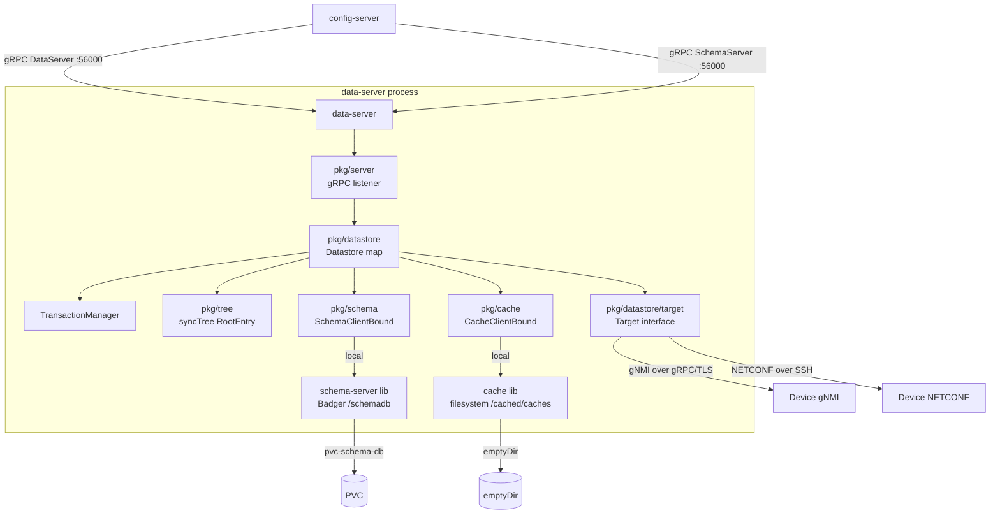
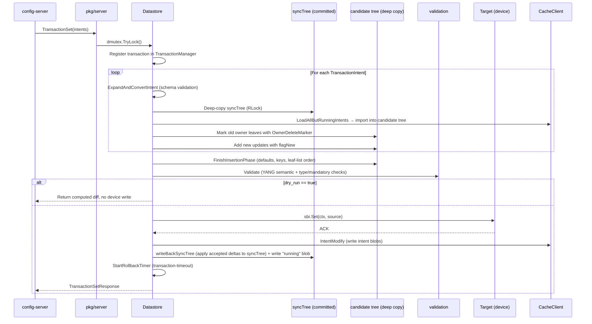

# Data Server

## Overview

`data-server` is the central southbound agent in the SDC stack. It owns one `Datastore` per managed target device and is responsible for:

- **Intent priority resolution** — merging multiple [Config](../user-guide/configuration/config/config.md)/[ConfigSet](../user-guide/configuration/config/configset.md) resources into a single, ordered config view
- **YANG validation** — enforcing schema constraints before any change reaches a device
- **Device push** — applying the resolved configuration via an embedded SBI driver (gNMI or NETCONF)
- **Deviation detection** — continuously comparing the intended state with the running state on the device

In the default production deployment, `data-server` embeds both the schema-server library (YANG parsing + Badger persistence) and the cache library (intent blob store) in-process, making it the single runtime process for all three components.

### Statefulness

| State | Owner | Persistent? |
|-------|-------|-------------|
| `syncTree` (`*tree.RootEntry`) | `Datastore` struct, in-memory | No — lost on pod restart |
| Intent blobs | cache library (filesystem, `emptyDir` volume) | No — lost on pod restart |
| Running intent blob | cache (written as `"running"` after each `TransactionSet`) | No — lost on pod restart |
| Parsed YANG schema objects | schema-server library (Badger, `pvc-schema-db` PVC) | Yes |
| Active gRPC server state | `server.Server` struct | No |
| Active transaction (at most one per datastore) | `TransactionManager` | No |

On pod restart, the cache (`emptyDir`) is empty and `syncTree` contains no intents. The schema DB on `pvc-schema-db` survives the restart; YANG schemas do not need re-parsing. The config-server (colocated controller) detects the empty state via target status conditions and re-applies all [Config](../user-guide/configuration/config/config.md)/[ConfigSet](../user-guide/configuration/config/configset.md) resources, driving [`TransactionSet`](https://github.com/sdcio/sdc-protos/blob/main/data.proto) calls that rebuild every intent blob.

---

## System-Reserved Intents and Priority Model

Every intent carries a priority value (int32); **lower numeric value = higher precedence**. When multiple intents set the same leaf path, the one with the lowest priority wins. Intents are merged in-memory by the `syncTree` and exported to cache as serialised [`tree_persist.Intent`](https://github.com/sdcio/sdc-protos/blob/main/tree_persist.proto) blobs.

### User Intents

User intents are created via [Config](../user-guide/configuration/config/config.md) and [ConfigSet](../user-guide/configuration/config/configset.md) Kubernetes resources. Their priority can be set explicitly; if omitted, it defaults to a system-assigned value. User intents must have a priority ≤ `UserSettableMax` (`MaxInt32 - 500 = 2147483147`), ensuring they remain in the user-reserved range below system-reserved priorities.

### System-Reserved Intent Names

The following intent names are reserved for data-server use:

| Intent Name | Priority | Purpose | Lifecycle |
|---|---|---|---|
| `"running"` | `MaxInt32 - 100` | Aggregate running config snapshot, recalculated after every `TransactionSet` | Temporary; not loaded on cold-start |
| `"replace"` | `MaxInt32 - 101` | Placeholder for replace-intent transactions (temporary delta) | Transaction-scoped |
| `"revrun"` | `MaxInt32 - 102` | Revert-running: captures the running config state at transaction start for rollback | Transaction-scoped |
| `"default"` | `MaxInt32 - 103` | YANG defaults supplied by the schema-server | Persistent; loaded on cold-start |

All system intents cluster near `MaxInt32`, so they act as low-precedence fallback values and lose to user intents on path conflicts.

### Priority Resolution at Read Time

When a leaf is read from the `syncTree`, the `LeafVariants.GetHighestPrecedence()` method compares all values across all intents and returns the one with the **lowest numeric priority number**. The caller never sees competing values; only the winning intent's data is exposed.

---

## Architecture Diagram (Mermaid)



---

## Datastore Lifecycle

A `Datastore` instance maps 1:1 to a managed target device. It is created by the `CreateDataStore` RPC and torn down by `DeleteDataStore`.

### `CreateDataStore`

1. Validate the request (name, schema reference, SBI type/address/port).
2. Build `*config.DatastoreConfig` from the proto fields.
3. Call `datastore.New(ctx, cfg, schemaClient, cacheClient)`:
   - Creates `SchemaClientBound` bound to the schema's vendor/name/version.
   - Allocates a `TreeContext` and `syncTreeRoot` (`tree.NewTreeRoot`).
   - Creates `CacheClientBound` bound to the cache instance named after the datastore.
   - Creates `TransactionManager` with a `DatastoreRollbackAdapter`.
   - Calls `initCache(ctx)` (blocking) — creates the cache instance on disk if it does not yet exist.
   - Starts a goroutine `connectSBI(ctx)` — blocking connect loop; once the SBI connection succeeds it starts the `DeviationMgr` goroutine.
4. Registers the datastore in `DatastoreMap`.

**`Datastore` key fields:**

```go
type Datastore struct {
    config             *config.DatastoreConfig
    cacheClient        cache.CacheClientBound
    sbi                target.Target
    schemaClient       schemaClient.SchemaClientBound
    syncTree           *tree.RootEntry
    syncTreeMutex      *sync.RWMutex
    dmutex             *sync.Mutex      // serialises transactions (one at a time)
    deviationClients   map[DataServer_WatchDeviationsServer]string
    transactionManager *types.TransactionManager
    taskPool           *pool.SharedTaskPool
}
```

### `DeleteDataStore`

1. Look up the datastore in `DatastoreMap`.
2. Call `ds.Delete(ctx)` → `d.cacheClient.InstanceDelete(ctx)` — removes all intent files from disk.
3. Call `ds.Stop(ctx)` — cancels the datastore context and closes the SBI target connection.
4. Remove the entry from `DatastoreMap`.

---

## Configuration Intent Lifecycle

The intent lifecycle follows a **confirmed-commit** pattern: every `TransactionSet` call arms a rollback timer. The operator (config-server) must send `TransactionConfirm` before the timer expires, or the change is automatically reverted.

### Phase A — `TransactionSet`

Entry point: `pkg/server/transaction.go` → `pkg/datastore/transaction_rpc.go`



**Step-by-step:**

1. **Lock datastore** via `d.dmutex.TryLock()`. Returns `ErrDatastoreLocked` if another transaction is active.
2. **Register transaction** in `TransactionManager` (at most one active at a time).
3. **For each `TransactionIntent`:**
   - Convert sdcpb → `types.TransactionIntent`; expand and validate updates against the schema via `treetypes.ExpandAndConvertIntent`.
   - Take a deep copy of `syncTree` under `syncTreeMutex.RLock`.
   - `LoadAllButRunningIntents` — stream all intent blobs from cache (excluding `"running"`) into the tree copy.
  - Mark old owner's leaves with `OwnerDeleteMarker`; save old intent content for rollback; add new updates with `flagNew`.
  - All merge and validation steps run on the candidate tree copy, not on `syncTree`.
4. **`FinishInsertionPhase`** — resolve defaults, key presence, and leaf-list ordering across the combined tree.
5. **Validation** (`validation.Validate`) — YANG semantic and type checks (including mandatory children, pattern/range/type constraints).
6. **Dry-run exit** — if `dry_run=true`, return the computed diff without touching the device or cache.
7. **Apply to device** — `d.sbi.Set(ctx, source)` blocks until the device ACKs.
8. **Write intent blobs** — `ops.TreeExport` → `tree_persist.Intent` → `cacheClient.IntentModify`.
9. **`writeBackSyncTree`** — applies accepted deltas from the candidate result back to `syncTree` and exports the resulting committed tree as the `"running"` blob.
10. **Start rollback timer** — armed for `transaction-timeout` (default 5 min). On expiry, `lowlevelTransactionSet` is called automatically with the captured old intent content.

**Validation context (what is checked and when):**

- **Path and schema expansion (early):** each incoming update is first normalized through `treetypes.ExpandAndConvertIntent`, which resolves schema-aware paths (including list key structure) and rejects paths that do not exist in the bound vendor/model/version schema.
- **Tree-shape correctness (mid-phase):** `FinishInsertionPhase` enforces structural correctness before full semantic validation, including key completeness for list entries and deterministic leaf-list ordering.
- **YANG semantic validation (pre-device):** `validation.Validate` runs after all intents are merged into one candidate view; this catches supported cross-field constraints and type-level issues (ranges, patterns, enums, mandatory children) using schema lookups via `SchemaClientBound`.
- **Error surfacing:** validation outcomes are returned in `TransactionSetResponse.Intents` for per-intent reporting. Requests with schema/validation failures do not call `Target.Set`, so invalid state never reaches the device.

**Implemented validation checks (current behavior):**

- Unknown or non-expandable schema paths are rejected during intent expansion.
- YANG list key completeness is enforced before semantic validation.
- Leaf-list ordering is normalized deterministically during insertion finalization.
- Mandatory children and required structural elements are enforced.
- Leaf type constraints are validated (including schema-driven type checks such as ranges/patterns/enums where defined).
- YANG `must` expressions are evaluated against the merged candidate tree.

### Phase B — `TransactionConfirm`

1. Find the active transaction by ID.
2. `transaction.Confirm()` — stops the rollback timer.
3. Transaction removed; device state stands.

### Phase C — `TransactionCancel` (or timer fires)

1. Build rollback transaction from `transaction.GetRollbackTransaction()` — uses `oldIntents` captured during Phase A.
2. Re-run `lowlevelTransactionSet` with the rollback transaction, pushing old content back to both the device and cache.
3. Transaction removed.

### `WatchDeviations`

The `DeviationMgr` goroutine starts once per datastore after the SBI connects. It runs on a ticker (default 30 s, overridable via `DEVIATION_INTERVAL`):

1. Emit `DeviationEvent_START` to all connected streaming clients.
2. `calculateDeviations(ctx)`:
  - Deep-copy `syncTree` to a candidate analysis tree.
  - `LoadAllButRunningIntents` — load all user intents into that copy.
  - `FinishInsertionPhase` — resolve the copied tree.
   - Emit `DeviationReasonIntentExists` per loaded intent name.
   - `ops.GetDeviations` — walk every leaf; compare the highest-priority intent value against the running value; emit `DeviationReasonOverruled` for any divergence.
   - Emit `DeviationReasonUnhandled` for paths present on the device but not covered by any intent.
3. Emit `DeviationEvent_END`.

### `BlameConfig`

1. Deep-copy `syncTree` to an analysis tree.
2. `LoadAllButRunningIntents` into that copy.
3. Create `processors.NewBlameConfigProcessor({IncludeDefaults: includeDefaults})`.
4. `bcp.Run(ctx, root.Entry, taskPool)` — annotates each leaf with the owning intent name and priority.
5. Return `BlameConfigResponse{Tree: *BlameTreeElement}` — a recursive tree where every leaf identifies which intent owns it.

---

## The Config Tree (`pkg/tree`)

`pkg/tree` implements the YANG-aware in-memory tree model used across data-server workflows: intent merge, validation, deviation detection, and blame attribution. Each datastore keeps one committed tree instance (`syncTree`) as its live baseline, while transaction and analysis logic runs on temporary deep copies and only applies accepted results back to the committed tree. The cache stores only serialised intent blobs; tree semantics and conflict handling remain in `pkg/tree`.

### Node Structure

The tree is composed of `Entry` nodes, each backed by a `sharedEntryAttributes` struct. The `String()` / `StringIndent()` methods produce an indented representation that reflects the actual in-memory layout. For a YANG list such as `interface`, there is a **list node** level (`interface`) and below it a **key-value node** (`eth0`) that carries the list key as its `pathElemName`:

```
interfaces
  interface              ← list node (schema = SchemaElem_List)
    eth0                 ← key-value node (schema = nil, pathElemName = key value)
      config
        mtu              ← leaf node
          -> Owner: network-team,  Priority: 100,          Value: 9000, New: false, Delete: false, DeleteIntendedOnly: false, ...
          -> Owner: platform-team, Priority: 200,          Value: 1500, New: false, Delete: false, DeleteIntendedOnly: false, ...
          -> Owner: running,       Priority: MaxInt32-100, Value: 9000, New: false, Delete: false, DeleteIntendedOnly: false, ...
```

This is an illustrative snapshot of the `String` / `StringIndent` output style: each level is indented by two spaces, and leaf variants are appended on `->` lines with owner, priority, value, and per-entry state flags (`New`, `Delete`, `Update`, `DeleteIntendedOnly`, `ExplicitDelete`, `Non-Revertive`). These are the complete leaf-entry flags currently rendered by the formatter.

Every `Entry` holds:

| Field | Type | Purpose |
|---|---|---|
| `pathElemName` | `string` | The YANG path element this node represents |
| `childs` | `*api.ChildMap` | Children map (mutually exclusive with `leafVariants`) |
| `leafVariants` | `*api.LeafVariants` | Per-owner leaf values at this path (leaf nodes only) |
| `schema` | `*sdcpb.SchemaElem` | Pointer to the YANG schema element — enables constraint checking without separate lookups |
| `choicesResolvers` | `api.ChoiceResolvers` | Tracks YANG `choice/case` selections to enforce mutual exclusion |
| `treeContext` | `api.TreeContext` | Shared context across all nodes (see below) |

### Multi-Owner Coexistence and Priority Resolution

Multiple intents can set the same leaf path simultaneously. All values are stored as `LeafEntry` records inside `LeafVariants` — one per owner. Nothing is discarded at write time.

At read time, `LeafVariants.GetHighestPrecedence()` scans the slice and picks the entry with the **lowest numeric priority value**:

```go
if highest.Priority() > e.Priority() {
    secondHighest = highest
    highest = e
}
```

The second-highest candidate is retained as a fallback in case the winner is marked for deletion. When the winning entry is removed (e.g. its intent is deleted), the next-highest candidate is automatically promoted — no re-import required.

`LeafVariants` also drives **deviation detection**: after computing the highest-precedence winner, it compares that value against the `running` variant (device state). Any mismatch produces a `DeviationEntry` with reason `DeviationReasonOverruled` or `DeviationReasonMissing`.

### TreeContext

A single `TreeContext` instance is shared across all nodes in a tree. It carries:

| Field | Purpose |
|---|---|
| `SchemaClientBound` | YANG schema access — passed once at tree creation, available to every node |
| `ExplicitDeletes` | Set of paths explicitly deleted by the current transaction |
| `NonRevertiveInfo` | Tracks which owners opt into non-revertive mode (winner stays even if a higher-priority intent appears) |
| `TaskPool` | Worker pool used by parallel operations in `pkg/tree/ops` |

### Lifecycle Phases

A tree is used in two distinct phases:

**Insertion phase** — intents are loaded via `AddUpdatesRecursive`. Entries are created or updated; leaf variants are appended. During this phase the tree may be partially inconsistent (e.g. list keys incomplete, YANG defaults unresolved).

**`FinishInsertionPhase`** — called once after all intents are loaded. This pass:
- Resolves YANG default values and injects them as `LeafEntry` records owned by `"default"`.
- Verifies list key completeness.
- Orders leaf-lists according to YANG ordering rules.

No read, validation, or export operation should be performed before `FinishInsertionPhase` completes.

The `syncTree` held by each datastore is always in finished state. Transactional mutations work on a `DeepCopy` of `syncTree`, apply changes, call `FinishInsertionPhase`, run validation, and only swap the copy into `syncTree` on success.

### Sub-packages

| Package | Key Types / Functions | Role |
|---|---|---|
| `pkg/tree/api` | `LeafVariants`, `LeafEntry`, `EntryOutputAdapter`, `IntentResponseAdapter` | Core tree API types; priority resolution; adapter bridge between tree results and gRPC response types |
| `pkg/tree/ops` | `TreeExport`, `GetDeviations`, `GetHighestPrecedence`, `LeafsOfOwner`, `validation.Validate` | Batch read operations; run concurrently via `TaskPool` |
| `pkg/tree/processors` | `OwnerDeleteMarker`, `BlameConfigProcessor`, `ExplicitDeleteProcessor`, `RemoveDeletedProcessor`, `ResetFlagsProcessor` | Processor pattern — each implements a tree-walk with side effects; composable pipeline |
| `pkg/tree/importer` | `proto/`, `xml/`, `json/` | Deserialise intent blobs (from cache), NETCONF XML, or JSON into tree nodes |
| `pkg/tree/types` | `Update`, `UpdateSlice`, `DeviationEntry`, `NonRevertiveInfo`, `DeleteEntriesList` | Shared value types passed between tree, datastore, and gRPC layers |
| `pkg/tree/consts` | Intent name constants (`RunningIntentName`, `DefaultsIntentName`, …) | Avoids magic strings throughout the tree |

---

## Target & SBI Abstraction

All southbound communication goes through the `Target` interface defined in `pkg/datastore/target/target.go`:

```go
type Target interface {
    Get(ctx context.Context, req *sdcpb.GetDataRequest) (*sdcpb.GetDataResponse, error)
    Set(ctx context.Context, source types.TargetSource) (*sdcpb.SetDataResponse, error)
    AddSyncs(ctx context.Context, sps ...*config.SyncProtocol) error
    Status() *types.TargetStatus
    Close(ctx context.Context) error
}
```

The factory function `target.New(ctx, name, cfg, schemaClient, runningStore, syncConfigs, taskpoolFactory)` dispatches on `cfg.Type`:

| `cfg.Type` | Driver | Package |
|------------|--------|---------|
| `"gnmi"` | `gnmiTarget` | `pkg/datastore/target/gnmi/` |
| `"netconf"` | `ncTarget` | `pkg/datastore/target/netconf/` |

### gNMI Driver

- **Library:** `github.com/openconfig/gnmic/pkg/api`
- **Connection:** gRPC with TLS and keepalive (ping every 10 s, timeout 2 s). Sends a `Capabilities` RPC on connect; rejects the configured encoding if the device does not advertise it.
- **`Set()`:** Builds a gNMI `SetRequest` from `TargetSource`. Encoding selection: `"json"` → `TypedValue_JsonVal`, `"json_ietf"` → `TypedValue_JsonIetfVal`, `"proto"` → per-leaf updates. Deletes use `ToProtoDeletes()`.
- **Sync modes:** `"stream"` (gNMI STREAM subscription), `"get"` (periodic Get), `"once"` (repeated ONCE subscriptions).

### NETCONF Driver

- **Library:** `github.com/scrapli/scrapligo/driver/netconf` — SSH-based NETCONF 1.0/1.1
- **Connection:** SSH with NETCONF hello exchange on `d.Open()`. Health is checked via `driver.IsAlive()`; a reconnect loop triggers on EOF.
- **`Set()` flow:**
  1. `source.ToXML(ctx, true, includeNS, operationWithNS, useOperationRemove)` — produces a single XML document; deletes are emitted inline with `operation="delete"` (or `"remove"`) attributes.
  2. `driver.EditConfig(commitDatastore, xmlDoc)` — sends `<edit-config>`.
  3. If `commitDatastore == "candidate"`: `driver.Commit()` sends `<commit/>`.
  4. RPC errors: `"warning"` severity → collected in response; `"error"` severity → discard + reconnect on EOF.
- **Sync:** Polling only via periodic `<get-config>`. NETCONF notification subscriptions are not used.
- **Note:** Lock/Unlock are present on the driver interface but are not called during `Set()` — there is no explicit lock-commit-unlock cycle.

**XML ↔ schemapb translation** (NETCONF only):

- `XMLConfigBuilder` — converts sdcpb path+value updates/deletes into NETCONF `<edit-config>` XML, calling `schemaClient.GetSchemaSdcpbPath()` per path element for namespace URI resolution.
- `XML2sdcpbConfigAdapter` — converts an `*etree.Document` (`<get-config>` response) into `[]*sdcpb.Notification`, querying the schema-server for leaf types and following leafref chains.

Testing-only target stubs exist in the codebase but are intentionally not documented as
supported southbound options.

---

## Schema Validation

`data-server` calls the schema-server for every operation that touches the YANG model:

| Operation | Call | When |
|-----------|------|------|
| Path validation / expansion | `ToPath`, `ExpandPath` | Processing `TransactionSet` updates |
| Schema node lookup | `GetSchema`, `GetSchemaDetails` | YANG validation (`validation.Validate`) — types, ranges, patterns, `must` expressions |
| List key completeness | `GetSchemaElements` | `FinishInsertionPhase` |
| Namespace resolution | `GetSchema` | XML construction for NETCONF `<edit-config>` |

All calls go through `schemaClient.SchemaClientBound`, which is bound to a specific vendor/name/version. In **local mode** (default), these are direct Go calls to `schema.LocalClient` sharing the same process. In **remote mode**, they are gRPC calls to a standalone schema-server pod.

---

## Configuration & Deployment

### Config File (`data-server.yaml`)

```yaml
grpc-server:
  address: :56000
  max-recv-msg-size: 4194304
  rpc-timeout: 60s
  tls:
    ca:
    cert:
    key:
    skip-verify: false
  schema-server:
    enabled: true
    schemas-directory: /schemas
  data-server:
    enabled: true

schema-store:           # mutually exclusive with schema-server
  type: persistent
  path: /schemadb
  read-only: false

cache:
  type: local
  store-type: filesystem
  dir: ./cached/caches

transaction-timeout: 5m

deviation-defaults:
  interval: 30s
```

**`schema-store` vs `schema-server`:** The presence of a `schema-store` section activates the embedded Badger store (local mode). Replacing it with a `schema-server` section (pointing to a remote address) switches to gRPC calls against a standalone schema-server pod.

**`cache.type`:** `local` embeds the cache in-process (default). `remote` points to a standalone cache-server pod over gRPC.

### CLI Flags

| Flag | Default | Description |
|------|---------|-------------|
| `--config` / `-c` | `` | Config file path (YAML) |
| `--debug` / `-d` | `false` | Enable debug log level |
| `--trace` / `-t` | `false` | Enable trace log level |
| `--version` / `-v` | `false` | Print version and exit |

### Environment Variables

| Variable | Description |
|----------|-------------|
| `EXTRA_LOG_FILE` | Optional additional log file path |
| `DEVIATION_INTERVAL` | Override the deviation polling interval (Go duration string, e.g. `60s`) |

### Ports

| Port | Protocol | Purpose |
|------|----------|---------|
| `:56000` | gRPC | `DataServer` + `SchemaServer` services |
| `:55555` | HTTP | Prometheus metrics |
| `localhost:6060` | HTTP | pprof profiling |

### Volumes

| Mount path | Source | Contents |
|------------|--------|---------|
| `/schemadb` | `pvc-schema-db` (PVC) | Badger database of parsed YANG schema objects |
| `/cached/caches` | `emptyDir` | Intent blobs (cache library filesystem store) |
| `/schemas` | ConfigMap / PVC | Raw YANG files loaded by the schema-server library |

### gRPC Services

Both the `DataServer` and `SchemaServer` services are registered on the same listener (`:56000`).

**`DataServer` RPCs:**

| RPC | Streaming | Description |
|-----|-----------|-------------|
| `CreateDataStore` | — | Create a datastore for a target device |
| `DeleteDataStore` | — | Remove a datastore |
| `GetDataStore` | — | Get datastore details |
| `ListDataStore` | — | List all datastores |
| `TransactionSet` | — | Start a transaction (write + apply intents) |
| `TransactionConfirm` | — | Commit a transaction; cancel the rollback timer |
| `TransactionCancel` | — | Roll back a transaction |
| `ListIntent` | — | List intent names and priorities in a datastore |
| `GetIntent` | — | Get the full content of an intent |
| `WatchDeviations` | Server-streaming | Stream deviation events (config drift detection) |
| `BlameConfig` | — | Return per-path intent ownership annotation |

---

## Interactions

| Direction | Component | Mechanism | Purpose |
|-----------|-----------|-----------|---------|
| Inbound | config-server | gRPC `DataServer` (`:56000`) | `TransactionSet/Confirm/Cancel`, `CreateDataStore`, `DeleteDataStore`, `WatchDeviations`, `BlameConfig`, `ListIntent`, `GetIntent` |
| Inbound | config-server | gRPC `SchemaServer` (`:56000`) | `CreateSchema` — schema reconciler registers YANG schemas on startup |
| Outbound | Device (gNMI) | gNMI over gRPC/TLS | `Set`, `Get`, `Subscribe` via openconfig/gnmic |
| Outbound | Device (NETCONF) | NETCONF 1.0/1.1 over SSH | `EditConfig`, `GetConfig`, `Commit` via scrapligo |
| Internal | schema-server lib | Direct Go calls (`LocalClient`) | Schema lookup, path expansion, validation, namespace resolution |
| Internal | cache lib | Direct Go calls (`LocalCache`) | Intent blob read / write / delete |

### Internal Package Map

| Package | Responsibility |
|---------|---------------|
| `pkg/server` | gRPC server; registers `DataServer` + `SchemaServer` on one port; interceptors |
| `pkg/datastore` | Core per-target logic: `Datastore` struct, transaction, deviations, intent CRUD |
| `pkg/datastore/target` | `Target` interface + factory; `gnmi/` and `netconf/` protocol packages |
| `pkg/tree` | YANG-aware in-memory config tree; priority resolution; validation |
| `pkg/tree/ops` | Batch tree operations: `TreeExport`, `GetDeviations`, `Validate` |
| `pkg/tree/processors` | Named tree processors: blame, delete-marking, flag reset |
| `pkg/tree/importer` | Import adapters: proto, XML, JSON |
| `pkg/schema` | Schema client abstraction: `LocalClient`, `RemoteClient`, `SchemaClientBound` |
| `pkg/cache` | Cache client abstraction: `LocalCache`, `RemoteCache`, `CacheClientBound` |
| `pkg/pool` | `SharedTaskPool` — bounded worker goroutine pool for parallel tree operations |
| `pkg/config` | All config structs, defaults, validation |
