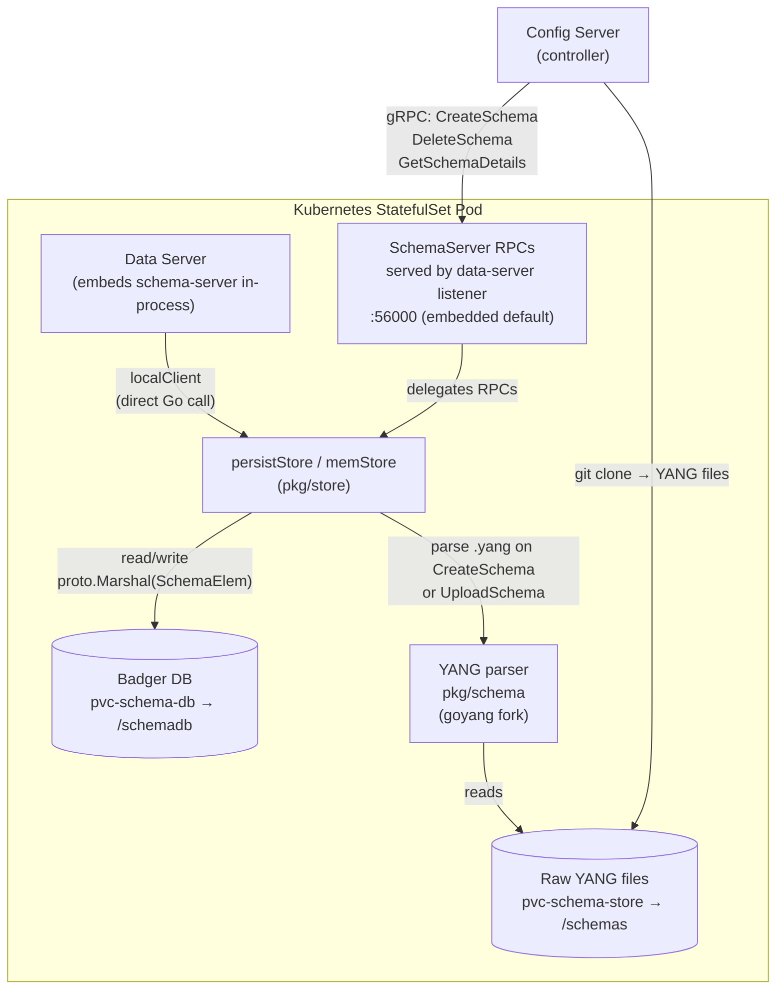

# Schema Server

## Overview

Schema Server is a Go library and optional standalone gRPC service that parses YANG modules from disk using the [SDC goyang fork](https://github.com/sdcio/goyang), serialises the resulting schema objects into a persistent embedded database (Badger v4), and serves schema metadata to other SDC components on demand. It is the single source of truth for all type, namespace, and constraint information derived from YANG.

**Deployment model.** The `schema-server` Go module (`github.com/sdcio/schema-server`) is imported directly by `data-server`. In the current production deployment, data-server embeds the schema store **in-process** — no separate schema-server pod is required. The standalone gRPC binary exists for future split-out deployments. The `cache` component follows the same pattern: it can be embedded (`type: local`) or remote (`type: remote`).

**Statefulness.**

| Store type | Backing | Persistence | Notes |
|------------|---------|-------------|-------|
| `persistent` (default) | Badger v4 embedded KV at `schema-store.path` | Survives restarts | Keys: `<vendor>@<name>@<version>/<path>`; values: `proto.Marshal(sdcpb.SchemaElem)`. If a key already exists on startup it is **not** re-parsed, so restarts are fast. |
| `memory` | `map[SchemaKey]*Schema` behind `sync.RWMutex` | Lost on restart | Useful for testing or ephemeral environments. |

A background goroutine runs `bdb.RunValueLogGC(0.7)` every minute to reclaim Badger value-log space.

`persistStore` can optionally wrap Badger lookups with a `ttlcache.Cache[cacheKey, *sdcpb.GetSchemaResponse]` (capacity + TTL configurable) to avoid repeated protobuf unmarshalling on hot paths.

---

## Architecture Diagram (Mermaid)



For split-out deployments, a standalone schema-server binary can expose the same RPCs on
its own listener (default `:55000`).

---

## Responsibilities

- **Parse YANG.** Consume `.yang` files (plus include/exclude globs), build a `yang.Entry` tree via the [SDC goyang fork](https://github.com/sdcio/goyang), resolve cross-module `leafref`, `augment`, and `uses` references.
- **Persist schemas.** Serialise each `yang.Entry` node as a `sdcpb.SchemaElem` proto into Badger, keyed by vendor/name/version and path. Skip already-persisted keys on restart for fast cold-start.
- **Serve schema metadata.** Answer `GetSchema`, `GetSchemaElements`, `ExpandPath`, and related RPCs used by data-server to validate paths and values, resolve XML namespaces, and expand wildcarded paths.
- **Lifecycle management.** Register, reload, and delete schemas at runtime without restarting the process.
- **Upload gateway (future).** Accept raw YANG file bytes over a client-streaming RPC (`UploadSchema`), write them to disk, then parse and persist.

---

## Schema Ingestion

### Static configuration at startup

Schemas listed under `schema-store.schemas` in the YAML config are parsed **concurrently at startup** (one goroutine per schema entry). If the `SchemaKey{Name, Vendor, Version}` already exists in Badger the schema is skipped — restarts are idempotent and fast.

### `CreateSchema` RPC

The caller provides the vendor, name, version, and paths to YANG files already on disk. The store parses them immediately and writes the result to the configured schema store; in persistent mode that store is Badger.

### `UploadSchema` RPC (three-phase client streaming)

1. **First message** — `UploadSchemaRequest_CreateSchema`: identifies the schema (vendor, version, exclude patterns).
2. **Subsequent messages** — `UploadSchemaRequest_SchemaFile`: chunked file bytes with an optional integrity hash (MD5, SHA-256, or SHA-512).
3. Files are written to `<schemas-directory>/<name>_<vendor>_<version>/`.
4. On stream close the server parses the uploaded files and stores them to Badger.

> `UploadSchema` is not actively used in the current K8s deployment; YANG files are supplied via a shared PVC cloned by the controller.

### YANG parsing (`pkg/schema/schema.go`)

1. `schema.NewSchema(cfg)` calls the SDC goyang fork to parse all `.yang` files matching the configured `files` + `directories` paths, minus any `excludes` patterns.
2. A root `yang.Entry` tree (`__root__`) is built where top-level children are individual YANG modules.
3. `buildReferencesAnnotation()` walks the tree and resolves cross-module `leafref`, `uses`, and `augment` references, annotating each `yang.Entry` node.
4. Each node is serialised as `proto.Marshal(sdcpb.SchemaElem)` and written to Badger with the key `<vendor>@<name>@<version>/__root__/<module>/<path...>`.

### Disk layout

```
<schema-store.path>/               # Badger DB (SSTs, value log, MANIFEST)
<schemas-directory>/
  <name>_<vendor>_<version>/       # one directory per uploaded schema
    *.yang                         # raw YANG source files
```

### K8s deployment flow

```
controller (Schema Reconciler)
  → git clone YANG files → pvc-schema-store (/schemas)
  → gRPC CreateSchema (paths on /schemas)
data-server (embedded schema-server)
  → parse YANG from /schemas
  → write Badger DB → pvc-schema-db (/schemadb)
```

---

## Schema Serving

**`GetSchema` request flow:**

1. Client calls `GetSchema(GetSchemaRequest{Schema: {Vendor, Version}, Path: <path>})`.
2. `persistStore.getSchema` constructs a Badger key from the schema key + path elements and performs a point lookup.
3. **Module prefix resolution:** if the first path element contains `:` the prefix selects the correct top-level module entry.
4. The raw bytes are unmarshalled from `proto.Marshal(sdcpb.SchemaElem)` and returned.
5. **TTL response cache:** if configured, `persistStore` checks a `ttlcache` (keyed by `{SchemaKey, path-as-string}`) before hitting Badger, avoiding repeated unmarshalling on hot paths.

**Hot-reload (`ReloadSchema`):** re-parses YANG files from their original configured paths. `Schema.Reload()` calls `NewSchema(sc.config)` to produce a fresh `Schema` value and then `store.AddSchema` replaces the Badger entries atomically.

**Per-datastore schema path cache (`SchemaClientBound`):** each data-server datastore holds a `SchemaClientBoundImpl` that wraps the schema `Client` and binds it to a fixed `{vendor, name, version}` triple. It maintains a `sync.Map` indexed by keyless path string → `*SchemaIndexEntry`. On the first lookup of a path the response is stored in the index; subsequent lookups return the cached entry without touching the store. This is the primary per-datastore hot-path cache.

---

## Configuration & Deployment

### CLI flags

| Flag | Default | Description |
|------|---------|-------------|
| `--config` / `-c` | `schema-server.yaml` | Path to YAML config file |
| `--debug` / `-d` | `false` | Set log level to DEBUG |
| `--trace` / `-t` | `false` | Set log level to TRACE |
| `--version` / `-v` | `false` | Print version and commit SHA |

### Full YAML config reference

```yaml
grpc-server:
  address: ":55000"
  max-recv-msg-size: 4194304   # bytes
  rpc-timeout: 1m
  tls:
    ca:
    cert:
    key:
    skip-verify: false
  schema-server:
    schemas-directory: ./schemas-dir   # landing dir for UploadSchema

schema-store:
  type: persistent       # "persistent" | "memory"
  path: ./schema-store   # Badger DB directory
  read-only: false
  cache:
    ttl: 5m
    capacity: 10000
    with-description: false
  schemas:
    - name: srl
      vendor: Nokia
      version: 23.7.1
      files:
        - ./yang/srl/srl_nokia/models
      directories:
        - ./yang/srl/ietf
      excludes:
        - .*tools.*

prometheus:
  address: ":9090"
```

### gRPC interface

**Service:** `SchemaServer` (proto package `sdcpb`, defined in [`sdc-protos/schema.proto`](https://github.com/sdcio/sdc-protos/blob/main/schema.proto))  
**Default standalone listen address:** `:55000`

In the default embedded deployment, `SchemaServer` RPCs are served by the `data-server`
process endpoint (commonly `:56000`), not by a separate `:55000` listener.

| RPC | Streaming | Description |
|-----|-----------|-------------|
| `GetSchema` | Unary | Returns one `SchemaElem` for a gNMI-style path |
| `GetSchemaElements` | Server-streaming | Streams all `SchemaElem`s along a path |
| `GetSchemaDetails` | Unary | Full details of a registered schema |
| `ListSchema` | Unary | List known schemas (name, vendor, version, status) |
| `CreateSchema` | Unary | Register schema metadata and trigger parse |
| `ReloadSchema` | Unary | Re-parse YANG files for an existing schema |
| `DeleteSchema` | Unary | Remove a schema from the store |
| `UploadSchema` | Client-streaming | Upload raw YANG file bytes then trigger parse |
| `ToPath` | Unary | Convert path element strings to a structured `Path` |
| `ExpandPath` | Unary | Enumerate all concrete sub-paths under a wildcarded path |

All RPC handlers in `pkg/server/rpcs.go` are thin wrappers that delegate directly to the `store.Store` interface.

### Startup behaviour

`main.go` wraps `server.Serve` in a `goto START` loop with a 1-second back-off, so the process automatically recovers from transient initialisation errors without an external supervisor.

External dependencies at startup: **none** — the schema-server dials no external gRPC services; all communication is inbound.

### Volume layout (K8s StatefulSet)

| Volume | PVC | Mount path | Contents |
|--------|-----|------------|----------|
| `schema-store` | `pvc-schema-store` | `/schemas` (controller + data-server) | Raw `.yang` files cloned from Git |
| `schema-db` | `pvc-schema-db` | `/schemadb` (data-server only) | Badger DB of parsed `SchemaElem` protos |

---

## Interactions

| Direction | Peer component | Mechanism | Purpose |
|-----------|---------------|-----------|---------|
| Inbound (embedded, current) | Data Server | Direct Go call via `localClient` (`pkg/schema/local.go`) | Validate paths and values, resolve XML namespaces, convert paths. No gRPC hop — in-process. |
| Inbound (remote, future) | Data Server | gRPC `SchemaServer` `:55000` | Same as above when data-server is configured with a `schema-server` address instead of a local `schema-store` |
| Inbound (gRPC) | Config Server (controller) | gRPC `SchemaServer` to the schema-server K8s Service (resolves to the data-server pod) | Schema Reconciler calls `GetSchemaDetails`, `CreateSchema`, `DeleteSchema` |
| None | Cache | — | Schema-server has no dependency on the cache component |

---

## Internal Package Tour

| Package | Purpose | Key types / functions |
|---------|---------|-----------------------|
| `pkg/server` | gRPC server init and lifecycle | `Server`, `NewServer()`, `Serve()`, `Stop()` |
| `pkg/server/rpcs.go` | Thin RPC handlers delegating to `store.Store` | all `SchemaServer` RPC methods |
| `pkg/config` | YAML config unmarshalling, TLS setup, validation | `Config`, `SchemaStoreConfig`, `SchemaConfig`, `GRPCServer` |
| `pkg/store` | `Store` interface and `SchemaKey` type | `Store`, `SchemaKey`, `Key()` |
| `pkg/store/persiststore` | Badger-backed store with optional TTL response cache | `persistStore`, `New()` |
| `pkg/store/memstore` | In-memory store | `memStore`, `New()` |
| `pkg/schema` | YANG parsing, `yang.Entry` → `sdcpb.SchemaElem` conversion | `Schema`, `NewSchema()`, `SchemaElemFromYEntry()` |
| `pkg/schema/container.go` | Converts container/list nodes | `containerFromYEntry()` |
| `pkg/schema/leaf.go` | Converts leaf/leaf-list nodes | `leafFromYEntry()` |
| `pkg/schema/references.go` | Resolves leafref / augment / uses cross-module references | `buildReferencesAnnotation()` |
| `pkg/schema/expand.go` | Path expansion for `ExpandPath` RPC | `Expand()` |
